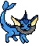

# Vapie



## Coords

Top left pixel: [1634, 2508](https://wplace.live/?lat=46.25481393022208&lng=21.381064121777342&zoom=15.922665954153272)

## Credits

**Artist**: FlooferLand (RO) #5674026

**Maintainer**: FlooferLand (RO) #5674026

Original design by Nintendo

## License

This art is licensed under [CC-BY-4.0](./LICENSE.md)

## Overlay Pro overlay

```json
{
    "version": 1,
    "name": "Vapie (by FlooferLand)",
    "imageUrl": "https://github.com/FlooferLand/wplace-art/blob/main/vapie/wplace_vapie.png?raw=true",
    "pixelUrl": "https://backend.wplace.live/s0/pixel/1145/726?x=635&y=508",
    "offsetX": -1,
    "offsetY": -1,
    "opacity": 0.7
}
```

> Use this with [Overlay Pro](https://greasyfork.org/en/scripts/545041-wplace-overlay-pro) in order to view the art as you're painting. It helps with repairs immensely.

---

> [!NOTE]
> This page is automatically generated via [_generator/](../_generator)